# Data Saturday 2026 - Piracicaba-SP
Photos and information about the local edition of Data Saturday in Piracicaba-SP, an event that took place on May 23, 2026 (Saturday).

## Event Information

Organizers:
- **Alexandre Ballestero de Paula (DEVPIRA)**
- **Kaue Barros (DEVPIRA)**
- **Hugo Venturini (Microsoft MVP)**
- **Renato Groffe (Microsoft MVP, Docker Captain, Grafana Champion, APISec U Ambassador, MTAC)**

Number of attendees: **40 people**

---

Talks that took place during the event:

_# Database Productivity with AI: simplifying day-to-day tasks with MCP Servers_

Speakers: **Renato Groffe (Microsoft MVP, Docker Captain, Grafana Champion, APISec U Ambassador, MTAC)** and **Milton Camara Gomes (Microsoft MVP)**

Technologies and topics covered: **MCP, GitHub Copilot, Visual Studio Code, Artificial Intelligence, LLMs, Containers, Docker, Docker Hub, Docker MCP Catalog, Windows, Linux, macOS, .NET, ASP.NET Core, NuGet, Node.js, npm, pip, Python, Claude, SQL Server, PostgreSQL, Mermaid, draw.io, Excalidraw...**

_# Multi-Agents and Workflows in Microsoft Agent Framework_

Speakers: **Carlos Machel (Microsoft MVP)** and **Marcio Nizzola (Microsoft MVP)**

Technologies and topics covered: **Artificial Intelligence, LLMs, AI Agents, Microsoft Agent Framework, Microsoft Foundry, C#, .NET, ASP.NET Core...**

_# SQL Server 2025 for DBAs and Developers_

Speaker: **Roberto Fonseca (Microsoft MVP)**

Technologies and topics covered: **SQL Server, Azure SQL, Microsoft Azure, Windows, Linux, Artificial Intelligence...**

_# Microsoft Fabric End-to-End - Real Case with INMET Data_

Speaker: **Hugo Venturini (Microsoft MVP)**

Technologies and topics covered: **Microsoft Fabric, Data Analytics, Artificial Intelligence, Business Intelligence, Azure SQL...**

_# Real Impact of AI on Data Projects_

Speaker: **Felipe Correia (Head of Data & AI)**

Technologies and topics covered: **Microsoft Fabric, Data Analytics, Artificial Intelligence, Business Intelligence, Azure SQL, Azure Data Factory...**

_# Firebird - Understanding Concurrency Control via MVCC/MGA/Versioning_

Speaker: **Carlos H. Cantu (FireBase Brasil)**

Technologies and topics covered: **Firebird, Relational Databases, Best Practices in Database Usage, Linux, Windows...**

---

Access this [**link**](/img/) to view all photos from the presentations.

Registration form: [**Eventiza**](https://eventiza.com.br/evento/devpira-datasaturday-piracicaba-2026)

Venue: **Parque Tecnológico Piracicaba "Engenheiro Agrônomo Emílio Bruno Germek" - Rua Cezira Giovanoni Moretti, 600 - Jardim Santa Rosa - Piracicaba-SP - ZIP: 13414-157**

We extend our gratitude to [**Parque Tecnológico Piracicaba**](https://www.linkedin.com/company/parquetecnologicopiracicaba/) for the opportunity and all the support in promoting this local edition of Data Saturday in Piracicaba-SP.

---

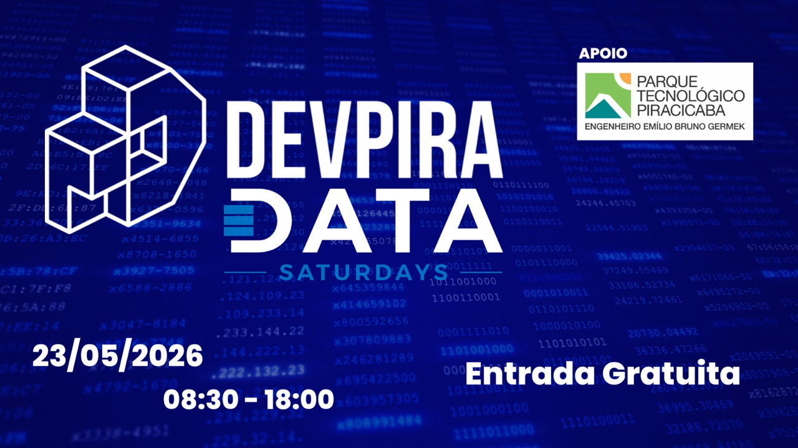

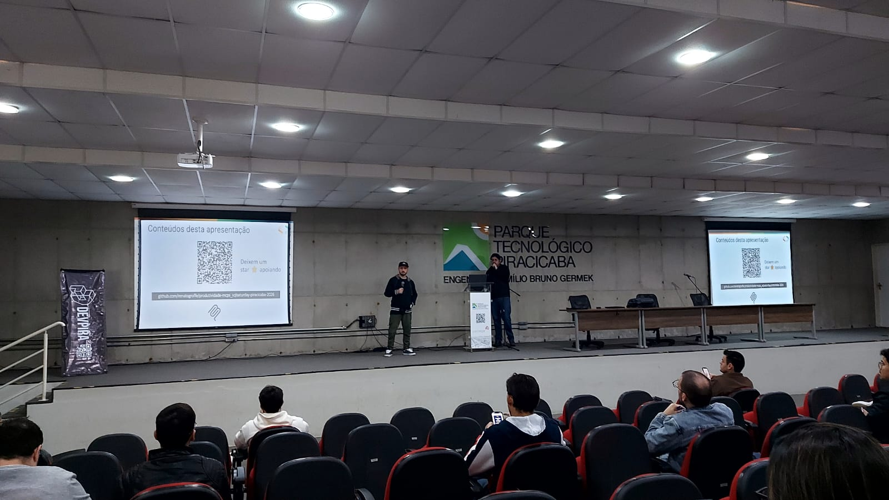

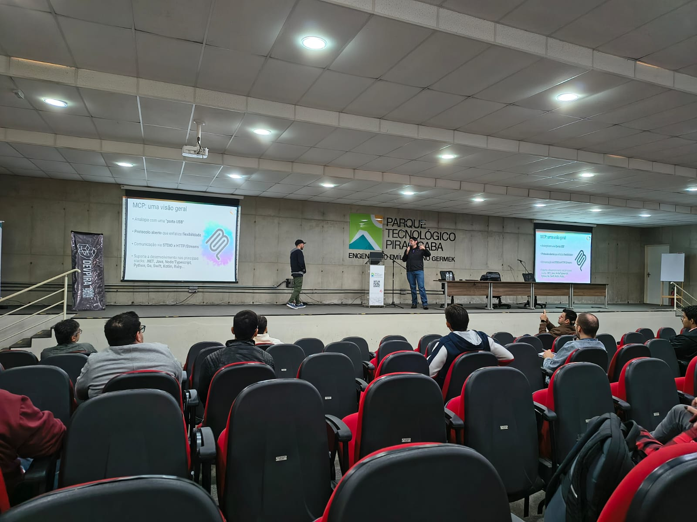

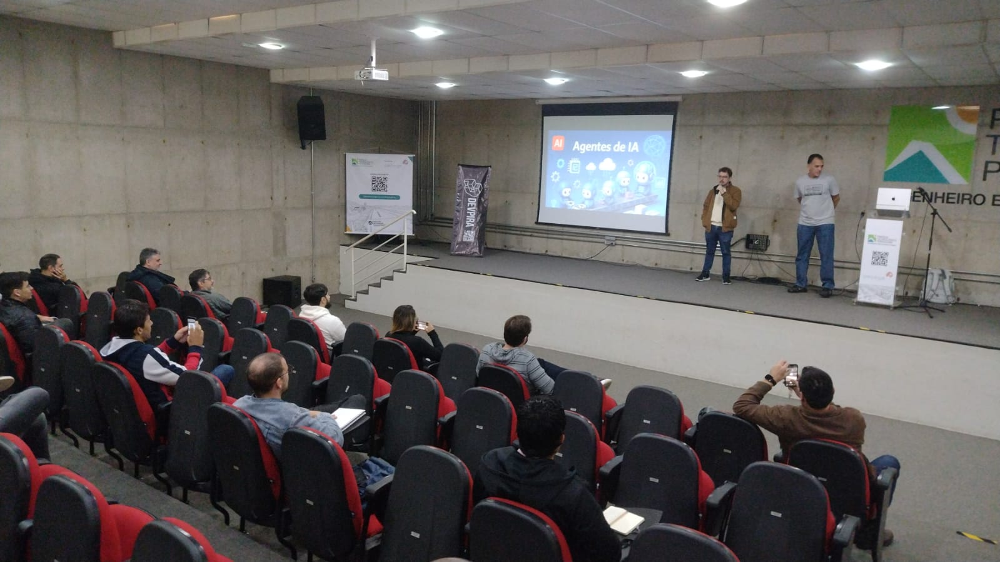

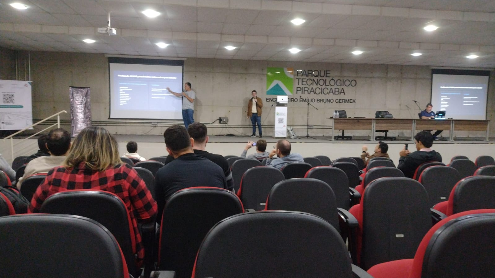

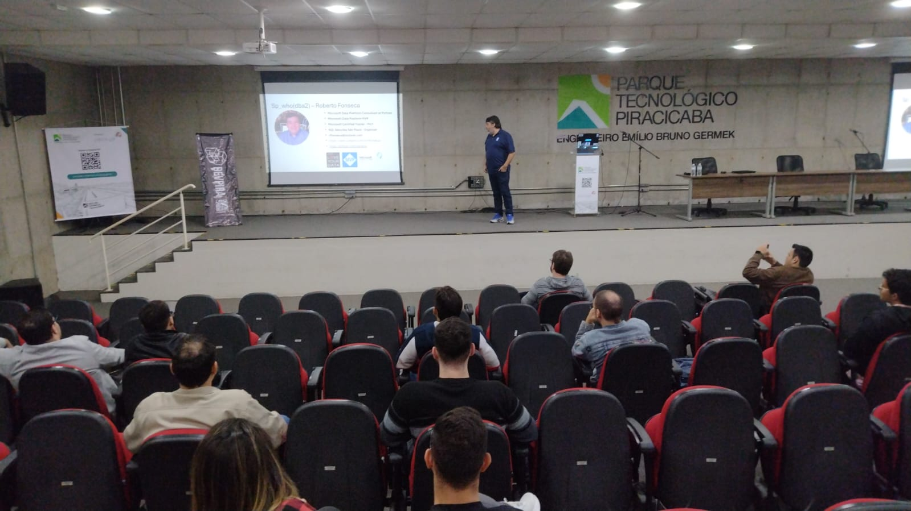

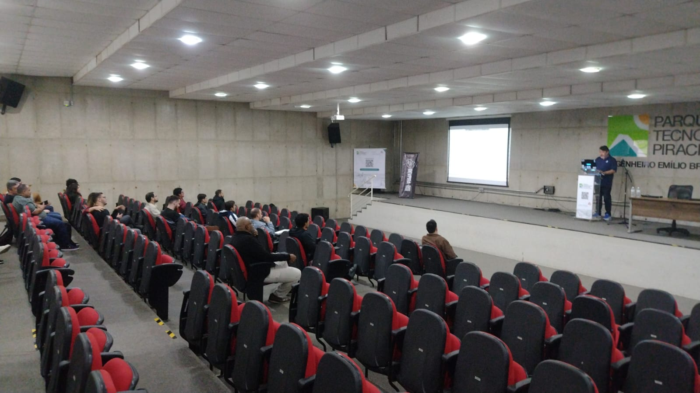

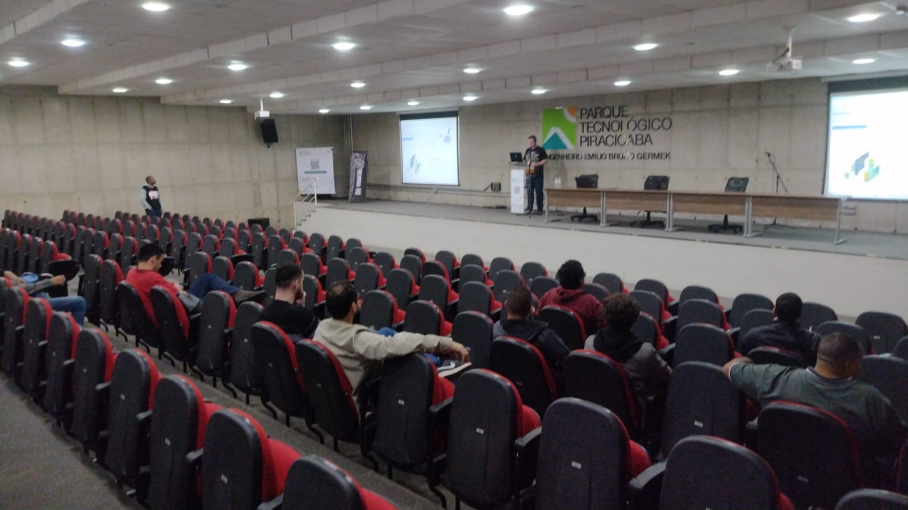

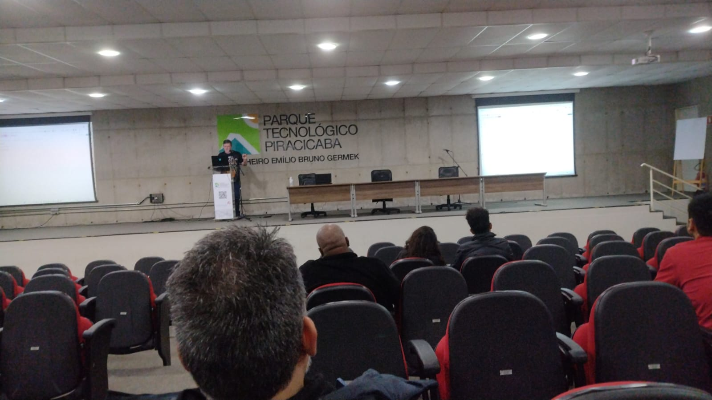

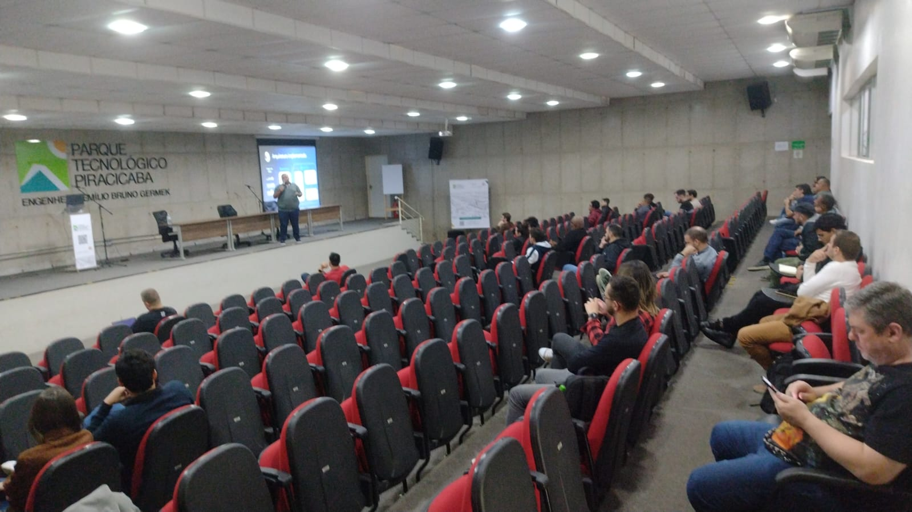

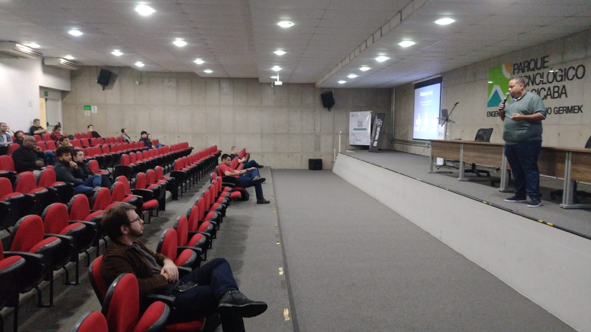

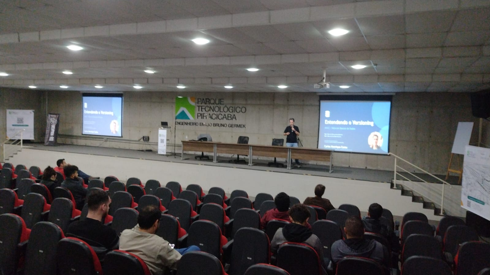

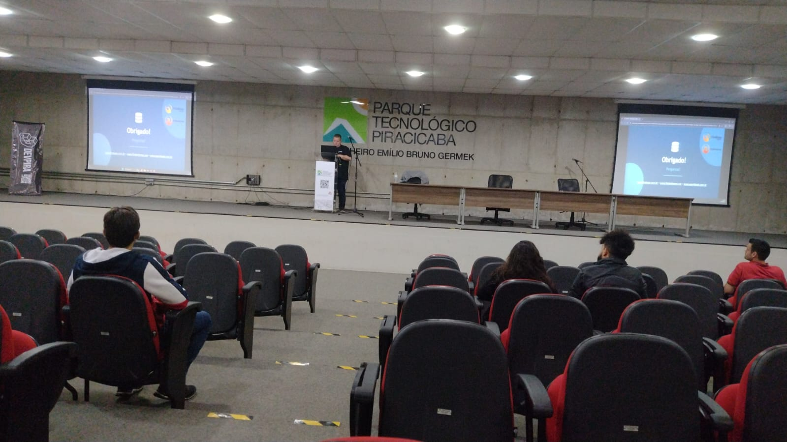

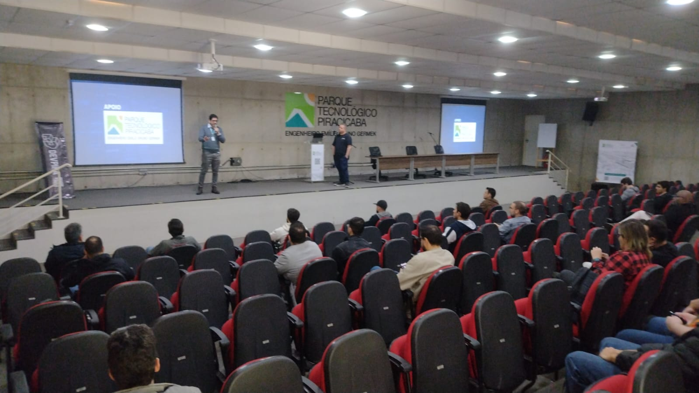

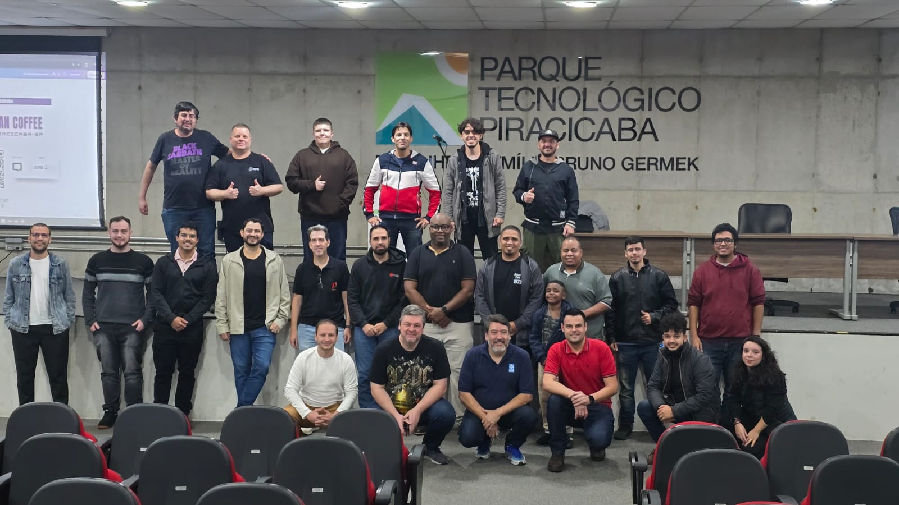
