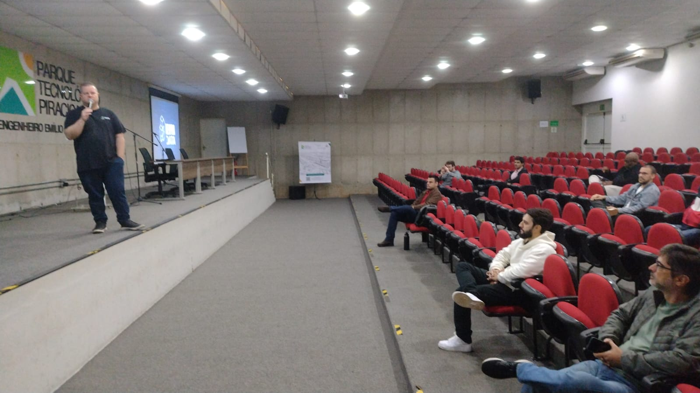

# data-saturday-2026-05-piracicaba
Fotos e informações da edição local do Data Saturday em Piracicaba-SP, um evento que aconteceu no dia 23/05/2026 (sábado).

## Informações sobre o evento

Organizadores:
- **Alexandre Ballestero de Paula (DEVPIRA)**
- **Kaue Barros (DEVPIRA)**
- **Hugo Venturini (Microsoft MVP)**
- **Renato Groffe (Microsoft MVP, Docker Captain, Grafana Champion, APISec U Ambassador, MTAC)**

Número de participantes: **40 pessoas**

xxxxxxxxxxxxxxxxxxxxxxxxxxxxxxxxxxxxxxxxxxxxxxxxxxxx
🔹 Felipe Correia – Impacto Real da IA nos Projetos de Dados

🔹 Hugo Venturini – Microsoft FABRIC de Ponta a Ponta: Caso Real INMET

🔹 Marcio Nizzola & Carlos Machel – Multi Agentes e Workflows no Microsoft Agent framework

🔹 Roberto Fonseca  – 

🔹  – Entendendo o controle de concorrência via MVCC/MGA/Versioning
xxxxxxxxxxxxxxxxxxxxxxxxxxxxxxxxxxxxxxxxxxxxxxxxxxxx

---

Apresentações que aconteceram durante o evento:

_# Produtividade no uso de Bancos de Dados com IAs: descomplicando tarefas do dia a dia com MCP Servers_

Palestrantes: **Renato Groffe (Microsoft MVP, Docker Captain, Grafana Champion, APISec U Ambassador, MTAC)** e **Milton Camara Gomes (Microsoft MVP)**

Tecnologias e tópicos abordados: **MCP, GitHub Copilot, Visual Studio Code, Inteligência Artificial, LLMs, Containers, Docker, Docker Hub, Docker MCP Catalog, Windows, Linux, macOS, .NET, ASP.NET Core, NuGet, Node.js, npm, pip, Python, Claude, SQL Server, PostgreSQL, Mermaid, draw.io, Excalidraw...**

_# SQL Server 2025 para DBAs e Desenvolvedores_

Palestrante: **Roberto Fonseca (Microsoft MVP)**

Tecnologias e tópicos abordados: **SQL Server, Azure SQL, Microsoft Azure, Windows, Linux, Inteligência Artificial...**

_# Microsoft Fabric de Ponta a Ponta - Caso Real com dados do INMET_

Palestrante: **Hugo Venturini (Microsoft MVP)**

Tecnologias e tópicos abordados: **Microsoft Fabric, Data Analytics, Inteligência Artificial, Business Intelligence...**

_# Microsoft Fabric de Ponta a Ponta - Caso Real com dados do INMET_

Palestrante: **Carlos H. Cantu (Microsoft MVP)**

Tecnologias e tópicos abordados: **Microsoft Fabric, Data Analytics, Inteligência Artificial, Business Intelligence...**

---

Acesse este [**link**](/img/) para visualizar todas as fotos das apresentações.

Formulário utilizado para inscrições: [**Eventiza**](https://eventiza.com.br/evento/devpira-datasaturday-piracicaba-2026)

Local: **Parque Tecnológico Piracicaba “Engenheiro Agrônomo Emílio Bruno Germek” - Rua Cezira Giovanoni Moretti, 600 - Jardim Santa Rosa - Piracicaba-SP - CEP: 13414-157**

Deixamos aqui nossos agradecimentos ao [**Parque Tecnológico Piracicaba**](https://www.linkedin.com/company/parquetecnologicopiracicaba/) pela oportunidade e todo o apoio para promovermos esta edição local do Data Saturday em Piracicaba-SP.

---

